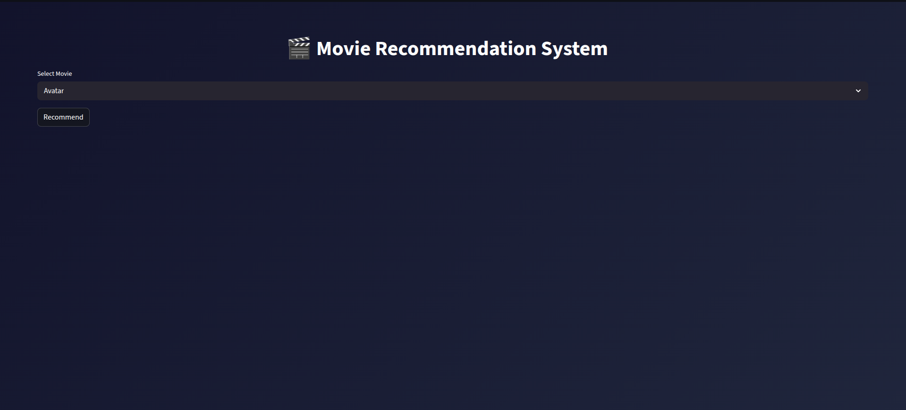
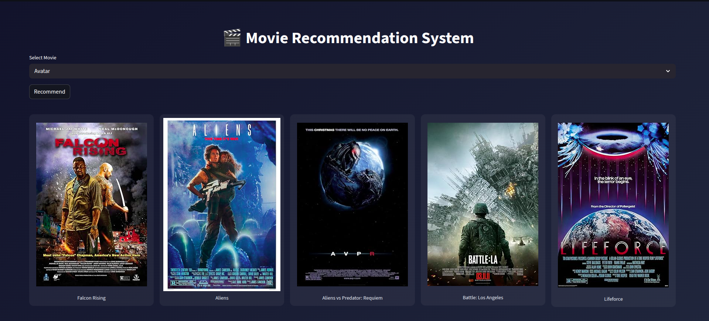
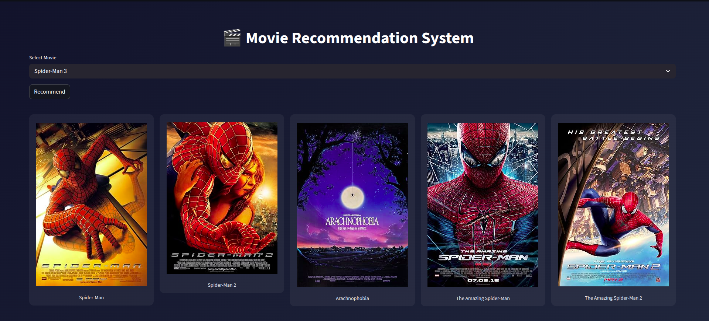
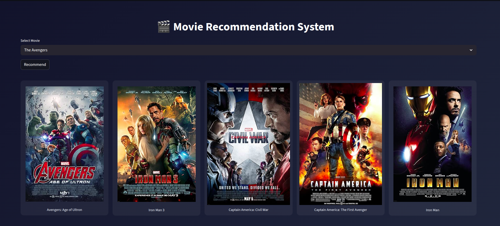

# 🎬 Movie Recommendation System

A content-based Movie Recommendation System built using **Machine Learning** and deployed with **Streamlit**.
It suggests similar movies based on user selection and displays their posters using the OMDb API.

---

## 🌐 Live Demo

🚀 Try the app here:  
👉 https://movie-recommendation-o038.onrender.com  

> ⚠️ Note: The app may take a few seconds to load initially due to free hosting cold start.

---

## 📸 App Preview

<table>
  <tr>
    <td></td>
    <td></td>
  </tr>
  <tr>
    <td></td>
    <td></td>
  </tr>
</table>

---

## 🚀 Features

* Recommend top 5 similar movies
* Content-based filtering using NLP techniques
* Movie poster fetching using OMDb API
* Simple and interactive UI with Streamlit
* Lightweight and fast (no heavy model files)

---

## 🛠️ Tech Stack

* Python
* Pandas, NumPy
* Scikit-learn (TF-IDF, Cosine Similarity)
* NLTK (Stemming)
* Streamlit
* OMDb API

---

## 📁 Project Structure

```
movie-recommender/
│
├── app/
│   ├── app.py
│   ├── recommender.py
│   ├── poster.py
│   └── .env
│
├── models/
│   ├── movie_titles.pkl
│   └── vectors.pkl
│
├── data/                  # Not included in repo
│
├── train.py
├── requirements.txt
├── .gitignore
└── README.md
```

---

## ⚙️ Setup Instructions

### 1. Clone the repository

```
git clone https://github.com/ICA-99/movie_recommendation.git
cd movie-recommender
```

---

### 2. Install dependencies

```
pip install -r requirements.txt
```

---

### 3. Add OMDb API Key

Create a `.env` file inside the `app/` folder:

```
OMDB_API_KEY=your_api_key_here
```

You can get a free API key from: https://www.omdbapi.com/apikey.aspx

---

## 📊 Dataset (Important)

The dataset is **not included** in this repository.

Download it from:

👉 https://www.kaggle.com/datasets/tmdb/tmdb-movie-metadata

After downloading, place the files inside:

```
data/
├── tmdb_5000_movies.csv
├── tmdb_5000_credits.csv
```

---

## 🧠 Train the Model

Run the training script to generate model files:

```
python train.py
```

This will create:

```
models/
├── movie_titles.pkl
├── vectors.pkl
```

---

## ▶️ Run the Application

```
cd app
streamlit run app.py
```

Then open your browser at:

```
http://localhost:8501
```

---

## ⚠️ Notes

* Do not upload `.env` or dataset files to GitHub
* Make sure `.pkl` files are generated before running the app
* Internet connection is required for fetching movie posters

---

## 📌 Future Improvements

* Better UI (Netflix-style cards)
* Use TMDB API for higher-quality posters
* Add search-based recommendations
* Deploy on cloud platforms

---

## 👨‍💻 Author

**Anjan Pal**

- 🔗 LinkedIn: https://www.linkedin.com/in/anjan-pal-ab5a5a247
- 💼 Open to opportunities in Machine Learning / Python Development

---

## ⭐ If you like this project

Give it a star ⭐ on GitHub!